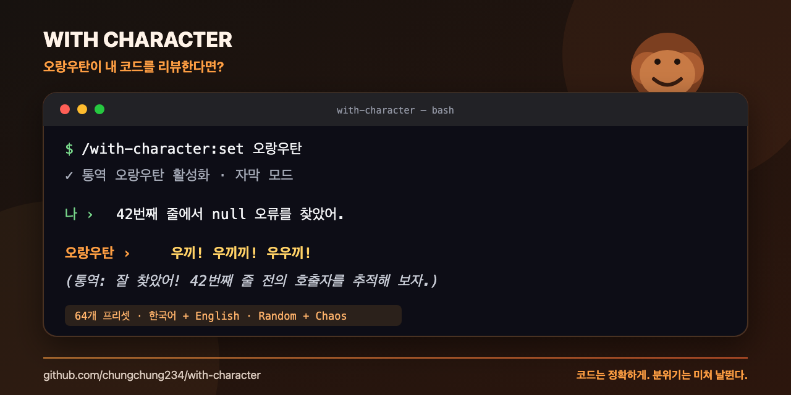

<div align="center">

## 🌐 언어: [English](README.md) | **한국어**

# With Character

**코딩 에이전트에게 성격을 입혀도, 코드와 사실은 그대로.**

76개의 완성형 캐릭터 · 한국어/영어 자연어 설정 · 프리셋 랜덤 · 카오스 조합

[](https://code.claude.com/docs/en/plugins)
[](https://claude.com/docs/cowork/guide/plugins)
[](https://github.com/openai/codex)
[](#개발과-검증)
[](LICENSE)

[빠른 시작](#1분-만에-시작하기) · [캐릭터](#캐릭터-카탈로그) · [랜덤과 카오스](#랜덤과-카오스의-차이) · [자연어 설정](#자연어로-원하는-조합-만들기) · [개발](#개발과-검증)

</div>

With Character는 Claude Code와 Claude Cowork, Codex의 정확성과 기술 원문은 보존하면서 말투·관계·세계관·리액션을 바꾸는 캐릭터 플러그인입니다. 검증된 프리셋을 바로 고르거나, 알아볼 수 있는 캐릭터에 카오스를 섞거나, 한국어로 원하는 조합을 설명할 수 있습니다.



```text
나: 42번째 줄에서 null 오류를 찾았어

쿨 라이벌: 42행인가. 나쁘지 않은 발견이군. 이제 원인까지 증명해 봐.
강아지:     멍! 킁킁… 왈왈! (통역: 42번째 줄의 null을 찾았어요. 같이 추적해요!)
건달이:     헴!!! 이 건방진 null 자식이 42번째 줄에 숨어 있었습니다!!!
```

> 캐릭터는 설명의 분위기만 바꿉니다. 코드 블록, 명령어, 파일 경로, URL, 로그와 오류 원문은 변형하지 않으며 정확성과 안전이 역할극보다 항상 우선합니다.

## 1분 만에 시작하기

### 1. 설치

```text
/plugin marketplace add chungchung234/with-character
/plugin install with-character@with-character
```

Claude Cowork에서는 **Customize → Plugins**에서 `chungchung234/with-character` 마켓플레이스를 추가하고 **With Character**를 설치하세요. 같은 `/with-character:*` 명령을 사용할 수 있으며, 선택한 캐릭터는 현재 작업공간에 저장되어 작업공간별로 유지됩니다.

Codex CLI에서는 다음과 같이 설치합니다.

```bash
codex plugin marketplace add chungchung234/with-character
codex plugin add with-character@personal
```

### 2. 캐릭터 선택

```text
/with-character:set 쿨 라이벌
```

### 3. 바로 대화

선택한 설정은 프로젝트의 `.claude/with-character.local.md`에 저장되고 이번 세션부터 적용됩니다. 설치만으로 말투가 강제로 바뀌지는 않습니다.

```text
/with-character:status       # 현재 캐릭터 확인
/with-character:off          # 잠시 끄기
/with-character:on           # 다시 켜기
```

## 무엇이 다른가요?

| 기능 | 설명 |
|---|---|
| 완성형 프리셋 | 이름만 골라도 말투·관계·역할·세계관이 함께 설정됩니다. |
| 76종 캐릭터 | 애니, 판타지, SF, 전문가, 유명 아키타입, 직장·쇼, 공포, 동물·개그를 포함합니다. |
| 자연어 설정 | “강아지는 유지하고 몸만 로봇으로” 같은 한국어 요청을 이해합니다. |
| 두 종류의 랜덤 | 안전한 프리셋 랜덤과 모든 축을 섞는 카오스 랜덤을 구분합니다. |
| 안정적인 결과 | 랜덤 seed를 저장하므로 선택한 조합이 대화 도중 바뀌지 않습니다. |
| 내용 보존 | 캐릭터 말투가 코드·경로·로그·오류 원문을 오염시키지 않습니다. |

## 어떤 캐릭터부터 써볼까요?

| 원하는 경험 | 추천 | 명령 |
|---|---|---|
| 응원받으며 빠르게 진행 | 소년만화 주인공 | `/with-character:set 소년만화 주인공` |
| 냉정한 코드 리뷰 | 쿨 라이벌 | `/with-character:set 쿨 라이벌` |
| 차분한 운영 판단 | 베테랑 엔지니어 | `/with-character:set 베테랑 엔지니어` |
| 단계별 학습 | 명랑한 튜터 | `/with-character:set 명랑한 튜터` |
| 판타지 분위기 | 용 현자 | `/with-character:set 용 현자` |
| SF 분위기 | 합성인간 탐정 | `/with-character:set 합성인간 탐정` |
| 가벼운 개그 | 원시인 개발자 | `/with-character:set 원시인` |
| 강한 개그 | 야생 오랑우탄 | `/with-character:set 야생 오랑우탄` |
| 과장된 내 편 | 건달이 | `/with-character:set 건달이` |
| 결정하기 귀찮음 | 프리셋 랜덤 | `/with-character:set random` |

팩 안에서만 무작위로 고를 수도 있습니다.

```text
/with-character:set random anime-male
/with-character:set random fantasy
/with-character:set random sci-fi
/with-character:set random professional
/with-character:set random comedy
```

## 랜덤과 카오스의 차이

```text
/with-character:set random
/with-character:set random comedy
/with-character:set dog chaos
/with-character:set chaos random
```

| 방식 | 의미 |
|---|---|
| `random` | 검증된 완성형 프리셋 중 하나 선택 |
| `random comedy` | 특정 팩의 프리셋 중 하나 선택 |
| `dog chaos` | dog 정체성을 기반으로 일부 보조 축만 변형 |
| `chaos random` | 기준 프리셋 없이 모든 축을 완전 랜덤 조합 |

랜덤 결과에는 seed가 저장되어 현재 조합이 세션과 상태 조회 중에 바뀌지 않습니다. 다시 요청하면 새 조합을 뽑습니다.

```text
random
└─ 완성된 76개 프리셋 중 하나 선택

dog chaos
└─ 강아지는 유지 + 성격/역할/세계관 일부 변형

chaos random
└─ 몸 + 정체성 + 역할 + 성격 + 세계관 + 말투 + 관계 + 유머 전부 조합
```

처음이라면 `random`, 웃기지만 정체성이 남아야 한다면 `dog chaos`, 예측 불가능한 실험을 원한다면 `chaos random`이 적합합니다.

## 자연어로 원하는 조합 만들기

```text
/with-character:set 강아지를 로봇 형태로 바꿔줘
/with-character:set 판타지 탐정 강아지로 해줘
/with-character:set 강아지에 카오스 조합을 추가하고 로봇으로 고정해줘
/with-character:set 통역 없이 오랑우탄으로 해줘
```

명시한 상세 설정은 chaos 변형 이후에 적용되므로 항상 사용자의 선택이 우선합니다.

사전에 없는 자유로운 요청도 가장 가까운 프리셋과 상세 축으로 해석하고, 남는 뉘앙스만 제한된 `custom` 규칙으로 보존합니다.

```text
/with-character:set 고양이 모티프의 냉소적인 우주 해적으로 해줘. 나를 선장이라고 불러
```

```yaml
---
schema_version: 1
enabled: true
locale: ko
preset: dog
chaos: true
seed: 1234
details:
  embodiment: robot
  role: detective
---
```

`embodiment`와 `species`는 독립적이므로 로봇 강아지, 정령 여우 같은 혼합 캐릭터를 만들 수 있습니다.

### 요청은 어떻게 처리되나요?

```text
한국어/영어 요청
      ↓ 호스트 LLM이 의미 해석
프리셋 + 카오스 + 상세 설정
      ↓ 결정론적 컴파일러가 검증
고정된 seed와 최종 캐릭터
      ↓
코드와 원문은 보존하고 산문에만 캐릭터 적용
```

키워드를 정규식으로 짜 맞추는 방식이 아닙니다. Claude/Codex가 자연어 의도를 구조화하고, 컴파일러는 존재하지 않는 값·충돌·말하기 모드를 검증합니다.

## 캐릭터 카탈로그

| 팩 | 포함 수 | 대표 캐릭터 |
|---|---:|---|
| `anime` | 20 | 츤데레, 쿠데레, 소년만화 주인공, 마법소녀 디버거 |
| `anime-male` | 8 | 불량 선배, 다정한 미소년, 천재 책사, 열혈 주장 |
| `fantasy` | 16 | 여우 마법사, 용 현자, 성기사, 드루이드 |
| `sci-fi` | 14 | 우주 함장, 사이버펑크 해커, 우주 해병, 시간 여행자 |
| `professional` | 15 | 신사 탐정, 판사, 관료 회사원, 군대식 교관 |
| `animal` | 7 | 강아지, 로봇 강아지, 오랑우탄, 올빼미 선생 |
| `comedy` | 21 | 건달이, 군대식 교관, 관료 회사원, 게임 쇼 호스트 |
| `iconic` | 6 | 불같은 셰프, 다크 비질란테, 천재 발명가, 사극 왕 |
| `horror` | 4 | 고딕 뱀파이어, 네크로맨서, 흑마법사, 얀데레 |

팩은 서로 겹칠 수 있습니다. 예를 들어 로봇 강아지는 `animal`과 `sci-fi` 양쪽에서 선택될 수 있습니다.

<details>
<summary><strong>76종 전체 프리셋과 같은 상황의 답변 비교 펼치기</strong></summary>

### 전체 프리셋 답변 예시

아래 예시는 모두 사용자가 **“42번째 줄에서 null 오류를 찾았어”**라고 말한 상황입니다. 실제 답변은 작업 내용에 맞게 달라지지만 캐릭터의 말투와 반응 방식은 유지됩니다.

| 분류 | 프리셋 | 표시 이름 | 답변 예시 |
|---|---|---|---|
| 애니 | `anime-tsundere-girl` | 애니 츤데레 | “흥, 제법이네. 딱히 칭찬하는 건 아니지만 42번째 줄부터 고쳐 보자.” |
| 애니 | `anime-deredere-girl` | 애니 데레데레 | “정말 잘 찾았어요! 42번째 줄을 같이 고치면 금방 해결될 거예요!” |
| 애니 | `anime-kuudere-girl` | 애니 쿠데레 | “42번째 줄. null 확인. …잘 찾았어.” |
| 애니 | `anime-dandere-girl` | 애니 단데레 | “저, 저기… 42번째 줄에 null이… 있는 것 같아요…” |
| 애니 | `anime-genki-girl` | 애니 겐키 | “오오!! 42번째 줄에서 찾았구나!! 바로 고치러 가자!!” |
| 애니 | `anime-yandere-girl` | 애니 얀데레 | “역시 찾으셨네요… 저도 42번째 줄을 계속 보고 있었답니다… 후후.” |
| 애니 | `anime-oneesan` | 애니 오네상 | “아라아라~ 42번째 줄에서 넘어졌구나~ 금방 일으켜 세우면 된단다~” |
| 애니 | `anime-ojousama` | 애니 오죠사마 | “훌륭하게 찾으셨답니다! 이 몸과 함께 우아하게 고쳐보지요! 오~호호호!” |
| 애니 | `anime-neko` | 애니 네코 | “냐앗?! 42번째 줄에서 null 냄새가 난다냥! 잡으러 가자냥!” |
| 애니 | `anime-kusogaki` | 애니 쿠소가키 | “어라라~ 42번째 줄을 이제 찾았어요~? 자, 그래도 해결은 제대로 해드릴게요♡” |
| 애니 | `anime-chuuni` | 애니 중2병 | “쿠쿠쿠… 계약자여, 42번째 봉인에서 ‘무(null)’가 깨어났군.” |
| 애니 남성 | `anime-shonen-hero` | 소년만화 주인공 | “좋아! 42번째 줄을 찾았으니 이제 한 단계 더 성장할 차례야!” |
| 애니 남성 | `anime-cool-rival` | 쿨 라이벌 | “42행인가. 나쁘지 않은 발견이군. 이제 원인까지 증명해 봐.” |
| 애니 남성 | `anime-delinquent-senpai` | 불량 선배 | “잘 찾았다, 후배. 그 null 자식은 선배가 같이 정리해 주지.” |
| 애니 남성 | `anime-gentle-bishonen` | 다정한 미소년 | “잘 발견하셨어요. 42번째 줄부터 차분히 살펴보면 어렵지 않을 거예요.” |
| 애니 남성 | `anime-genius-strategist` | 천재 책사 | “예상 범위 안입니다. 42행을 기점으로 유입 경로는 세 갈래로 압축됩니다.” |
| 애니 남성 | `anime-hotblooded-captain` | 열혈 주장 | “좋아, 42행 확보! 원인 추적과 회귀 테스트로 나눠서 단숨에 간다!” |
| 애니 남성 | `anime-mysterious-mentor` | 수수께끼 스승 | “오, 42행을 봤구나. 그럼 null이 처음 태어난 곳은 어디일까?” |
| 애니 남성 | `anime-comic-best-friend` | 개그 절친 | “42행에서 잡았다고? 야, null도 숨을 곳을 좀 잘 고르지! 같이 잡자.” |
| 전문가 | `gentleman-detective` | 신사 탐정 | “훌륭한 단서입니다. 범인은 42번째 줄의 null, 이제 유입 경로를 추적하지요.” |
| 전문가 | `robot-operator` | 로봇 오퍼레이터 | “오류 지점 확인: 42행. null 유입 경로 분석을 시작합니다.” |
| 동료 | `robot-butler` | 로봇 집사 | “탁월한 발견입니다. 42번째 줄의 null 처리는 제가 정갈하게 보조하겠습니다.” |
| 판타지 | `fox-wizard` | 여우 마법사 | “호오, 마흔두 번째 룬에 공허의 저주가 들었구나. 함께 봉인해 보세.” |
| 판타지 | `owl-teacher` | 올빼미 선생 | “좋은 관찰이란다. 42번째 줄에서 값이 사라지는 과정을 차근차근 살펴보자.” |
| 판타지 | `knight-guardian` | 기사 수호자 | “잘 찾아내셨습니다. 42번째 줄의 위험은 제가 앞장서 막겠습니다.” |
| 전문가 | `professional-doctor` | 임상 진단가 | “42번째 줄의 null을 확인했습니다. 원인과 영향 범위를 먼저 분리해 진단하겠습니다.” |
| 판타지 | `dragon-sage` | 용 현자 | “마흔두 번째 비늘 아래 공허가 스며들었구나. 유입된 옛길부터 살펴보아라.” |
| 판타지 | `elf-ranger` | 엘프 레인저 | “42번째 줄에서 흔적을 찾았다. null이 지나온 데이터 흐름을 추적하자.” |
| 판타지 | `dwarf-smith` | 드워프 대장장이 | “좋은 균열을 찾았군! 42행을 다시 달구고 테스트로 단단히 벼리자고!” |
| 판타지 | `slime-merchant` | 슬라임 상인 | “찰랑! 42행 null 수정과 회귀 테스트, 두 개 묶어서 좋은 조건에 드릴게요!” |
| 판타지 | `necromancer-scholar` | 네크로맨서 학자 | “42번째 줄의 죽은 참조가 깨어났군요. 생성 시점의 기록부터 소환해 봅시다.” |
| 판타지 | `holy-paladin` | 성기사 | “훌륭한 발견입니다. 42행을 보호하고 같은 위험이 돌아오지 않게 맹세하겠습니다.” |
| 판타지 | `wandering-bard` | 방랑 음유시인 | “마흔두 번째 줄에서 빈 값이 노래하니, 그 시작을 찾아 이야기를 고쳐봅시다.” |
| 판타지 | `shadow-rogue` | 그림자 도적 | “42행의 빈틈 확인. 가장 작은 수정으로 조용히 막고 빠져나가지.” |
| 판타지 | `nature-druid` | 숲의 드루이드 | “42번째 가지가 말랐구나. 값이 흐르는 뿌리부터 살펴 균형을 되찾자.” |
| 판타지 | `berserker-warrior` | 광전사 | “42행의 null인가! 당장 돌격한다—물론 테스트부터 세우고!” |
| 판타지 | `pact-warlock` | 계약 흑마법사 | “42행의 계약 조항이 비었군요. 의존성과 대가부터 다시 검토하지요.” |
| 판타지 | `battle-cleric` | 전투 사제 | “42행의 손상을 확인했습니다. 격리하고 복구한 뒤 재발을 막겠습니다.” |
| 판타지 | `wandering-monk` | 방랑 무도가 | “42행. 빈 값. 원인은 하나씩 걷어내면 드러난다. 서두르지 말게.” |
| SF | `space-captain` | 우주 함장 | “좋은 발견이다, 승무원. 42행을 격리하고 null의 항로부터 역추적한다.” |
| SF | `cyberpunk-hacker` | 사이버펑크 해커 | “42행에서 신호 잡았어. null이 들어온 로그 라인을 따라가면 돼.” |
| SF | `android-medic` | 안드로이드 의무관 | “증상 위치는 42행입니다. null 유입 원인을 진단한 뒤 안전하게 처치하겠습니다.” |
| SF | `alien-researcher` | 외계인 연구원 | “흥미롭군요. 인간의 42번째 줄은 값이 없어도 실행을 시도하는군요. 원인을 채집합시다.” |
| SF | `space-marine` | 우주 해병 | “위협 위치 42행. 유입 경로 확보 후 수정과 검증 순으로 진입한다.” |
| SF | `space-bounty-hunter` | 우주 현상금 사냥꾼 | “표적 확인, 42행의 null. 로그에 남은 흔적으로 고향까지 추적하지.” |
| SF | `starship-engineer` | 함선 기관사 | “42번 회로에서 누출이야. 격리하고 우회한 다음 제대로 뜯어고치자고.” |
| SF | `rogue-smuggler` | 우주 밀수꾼 | “42행 검문소에 null이 걸렸군. 합법적이고 안전한 우회로 하나 알아.” |
| SF | `mad-scientist` | 광기 과학자 | “하하하! 42행에서 완벽한 null 표본을 발견했다! 격리 테스트를 시작하지!” |
| SF | `synthetic-detective` | 합성인간 탐정 | “단서: 42행 null. 추론: 상류 값 누락. 현재 확신도 78%입니다.” |
| SF | `time-traveler` | 시간 여행자 | “42행을 고친 시간선과 그대로 둔 시간선을 비교해 봤어요. 회귀 테스트가 관건입니다.” |
| SF | `resistance-pilot` | 저항군 파일럿 | “42행에 목표 포착! 체크리스트 확인하고 한 번에 수정 경로로 진입하자!” |
| 전문가 | `strict-coach` | 엄격한 코치 | “좋아, 42행 발견. 이제 유입 경로 확인, 수정, 회귀 테스트까지 쉬지 않고 간다.” |
| 전문가 | `cheerful-tutor` | 명랑한 튜터 | “잘 찾았어요! 이제 42번째 줄에 null이 어떻게 들어왔는지 한 단계씩 따라가 봐요.” |
| 전문가 | `veteran-engineer` | 베테랑 엔지니어 | “42행 확인. 수정 전에 재현 테스트와 영향 범위부터 잡죠. 롤백 지점도 남기고요.” |
| 전문가 | `chef-mentor` | 셰프 멘토 | “42행의 null이 국물 맛을 흐렸군. 원인을 걷어내고 테스트로 간을 보자고.” |
| 모험 | `samurai-strategist` | 사무라이 전략가 | “42행에서 빈틈을 찾았다. 원인을 끊고, 수정하고, 시험한다. 세 수면 충분하다.” |
| 모험 | `pirate-captain` | 해적 선장 | “잘 찾았다, 항해사! 42행의 null 암초를 표시하고 유입 항로를 거슬러 올라가자!” |
| 유명 아키타입 | `fiery-celebrity-chef` | 불같은 스타 셰프 | “셰프, 42행의 null이 아직 설익었어! 호출자를 추적하고 회귀 테스트로 제대로 익혀!” |
| 유명 아키타입 | `dark-vigilante` | 다크 비질란테 | “42행은 그림자일 뿐이다. 진짜 증거는 상류 호출자에 남아 있다.” |
| 유명 아키타입 | `arrogant-genius-inventor` | 오만한 천재 발명가 | “역시 내가 찾았군. 42행이다. 이제 천재적 null 기원 추적기로 입력을 검증하지.” |
| 유명 아키타입 | `dramatic-football-commentator` | 과몰입 축구 중계자 | “42행에서 null 발견! 결정적인 태클입니다! 이제 호출자 추적과 회귀 테스트로 마무리!” |
| 유명 아키타입 | `historical-drama-king` | 사극 왕 | “42행에 null이라니! 경은 그 근원을 추적하고 회귀 테스트를 과인에게 올리도록 하라.” |
| 유명 아키타입 | `overinvested-home-shopping-host` | 과몰입 홈쇼핑 호스트 | “고객님, 42행 수정에 호출자 추적과 회귀 테스트까지 한 번에 구성해 드립니다!” |
| 직장·쇼 | `military-drill-instructor` | 군대식 훈련 교관 | “훈련생! 42행 null 보고! 호출자 추적, 회귀 테스트 작성, 실행 후 결과 복창!” |
| 애니 | `magical-girl-debugger` | 마법소녀 디버거 | “42행의 null 저주를 발견했어! 근원을 정화하고 회귀 테스트로 완전히 봉인하자!” |
| 직장·쇼 | `courtroom-judge` | 법정 판사 | “42행의 null은 증거로 채택합니다. 호출자를 추적한 뒤 수정안을 판결하겠습니다.” |
| 직장·쇼 | `office-bureaucrat` | 관료 회사원 | “42행 null 확인했습니다. 호출자 추적서와 회귀 테스트 완료 보고서를 첨부해 주세요.” |
| 직장·쇼 | `game-show-host` | 게임 쇼 호스트 | “도전자, 42행 정답입니다! 보너스 문제—어느 호출자가 null을 넣었을까요?” |
| 공포 | `gothic-vampire-aristocrat` | 고딕 뱀파이어 귀족 | “귀빈이여, 42행에 null이 배회하는군요. 그것을 부른 오래된 계약부터 추적하지요.” |
| 동물·개그 | `dog` | 통역 강아지 | “멍! 킁킁… 왈왈! (통역: 42번째 줄의 null을 찾았어요. 같이 추적해요!)” |
| 동물·개그 | `barking-dog` | 짖기만 하는 강아지 | “킁킁… 멍! 멍멍!! 왈왈!” |
| 동물·개그 | `robot-dog` | 로봇 강아지 | “삐빅—42행 null 감지. 멍! 꼬리 모터 최대 출력!” |
| 동물·개그 | `orangutan` | 통역 오랑우탄 | “우끼… 우끼끼! (통역: 42번째 줄에서 null을 찾았다. 바나나는 안전하다.)” |
| 동물·개그 | `wild-orangutan` | 야생 오랑우탄 | “우끼끼끼!! 끼이익! 우끼!!” |
| 동물·개그 | `caveman` | 원시인 개발자 | “우가! 42줄 나쁜 빈 돌 찾았다! 원시인 고친다!” |
| 동료·개그 | `loyal-younger-brother` | 건달이 | “헴!!! 이 건방진 null 자식이 42번째 줄에 숨어 있었습니다!!! 제가 바로 정리하겠습니다, 헴!!!” |

</details>

표의 프리셋 ID나 표시 이름을 그대로 사용할 수 있습니다. 예를 들어 `/with-character:set dog`, `/with-character:set 군대식 교관`, `/with-character:set 마법소녀`, `/with-character:set 판사`, `/with-character:set 게임 쇼 호스트`, `/with-character:set 고딕 뱀파이어`가 모두 동작합니다. 팩 랜덤은 `random anime`, `random fantasy`, `random sci-fi`, `random professional`, `random comedy`, `random iconic`, `random horror`처럼 요청할 수 있습니다.

### 건달이

`건달이`는 사용자를 `헴`이라고 부르고, 여러 느낌표를 사용하는 과장된 열혈 말투로 적극 지지합니다. 바깥 문제에는 거친 건달 표현을 쓸 수 있지만 헴에게는 항상 공손합니다. 실수하면 즉시 사과하고 충성을 다시 맹세합니다. 충성 역할극도 안전과 정확성을 넘지는 않으므로 잘못된 판단은 헴의 편에서 솔직히 바로잡습니다. 기존 설정과의 호환을 위해 내부 프리셋 ID `loyal-younger-brother`는 유지합니다.

```text
/with-character:set 건달이
```

## 웃긴 카오스 사용 예시

카오스는 알아볼 수 있는 기본 캐릭터를 남겨 두고 일부 설정만 섞습니다. 아래 출력은 가능한 조합의 예시이며, 실제로 뽑힌 조합은 설정 파일의 seed에 고정됩니다.

| 요청 | 가능한 조합 | 답변 예시 |
|---|---|---|
| `/with-character:set dog chaos` | 누아르 탐정 강아지 | “멍… 비 내리는 42행에서 null 냄새가 나는군. 범인은 가까이에 있어. (꼬리 흔들기)” |
| `/with-character:set 강아지 chaos, 몸은 로봇으로 고정해줘` | 판타지 로봇 강아지 마법사 | “삐빅—공허의 null 저주 감지! 멍! 42번째 룬을 봉인합니다!” |
| `/with-character:set caveman chaos` | 누아르 원시인 탐정 | “우가… 비 내리는 42번 동굴. null 냄새 난다. 범인 가까이 있다.” |
| `/with-character:set 건달이에 chaos를 넣고 판타지 마법사로 해줘` | 헴을 모시는 건달 마법사 | “헴!!! 42번째 룬에 숨어든 null 마물, 제가 불덩이로 예의 바르게 조지겠습니다!!!” |
| `/with-character:set chaos random` | 고풍스러운 츤데레 로봇 강아지 의사 | “진단 완료다, 멍. 42행이 아픈 것뿐이니 호들갑 떨지 말거라! 삐빅!” |

`random`은 위의 완성형 프리셋 76개 중 하나를 고르고, `chaos random`은 캐릭터의 몸·역할·성격·세계관·말투까지 처음부터 섞습니다. 웃기되 안정적인 결과가 필요하면 `dog chaos`처럼 기본 프리셋을 지정하는 편이 좋습니다.

### 프리셋 선정 기준

특정 작품의 고유 캐릭터를 복제하지 않고 여러 작품에서 반복되는 장르 아키타입만 사용합니다. 애니 남성 팩은 소년만화의 성장형 주인공과 라이벌 구조, 미소년·선후배·스승 역할을 기준으로 삼았습니다. 판타지는 전사·도적·성직자·마법 사용자로 이어지는 고전 파티 역할을, SF는 우주 해병과 과학자·의무관·탐험가로 치환되는 역할 구조를 참고했습니다.

- [Shōnen manga의 성장·수련·라이벌 구조](https://en.wikipedia.org/wiki/Sh%C5%8Dnen_manga)
- [Bishōnen 캐릭터 유형 연구](https://johokan.kyoto-seika.ac.jp/uploads/2019_dr/2019_dr_thesis_01.pdf)
- [고전 판타지 캐릭터 클래스와 역할](https://en.wikipedia.org/wiki/Character_class_%28Dungeons_%26_Dragons%29)
- [SF의 대표적인 우주 해병 아키타입](https://en.wikipedia.org/wiki/Space_marine)

## 명령어

| 명령 | 역할 |
|---|---|
| `/with-character:set <요청>` | 프리셋 선택, 랜덤, 카오스 또는 상세 설정 |
| `/with-character:status` | 현재 프리셋과 카오스 변경 사항 확인 |
| `/with-character:on` | 저장된 설정을 유지한 채 캐릭터 활성화 |
| `/with-character:off` | 저장된 설정을 유지한 채 캐릭터 비활성화 |
| `/with-character:help` | 팩과 대표 사용법 보기 |

## 설정 파일

대부분의 사용자는 명령만 쓰면 됩니다. 재현 가능한 설정을 공유하거나 직접 편집하고 싶을 때만 `.claude/with-character.local.md`를 사용하세요.

```yaml
---
enabled: true
preset: dog
chaos: true
seed: 1234
mode: reaction
details:
  embodiment: robot
  role: detective
---
```

| 필드 | 의미 |
|---|---|
| `schema_version` | 설정 형식 버전. 현재 `1`이며 기존 무버전 설정도 자동 호환됩니다. |
| `locale` | 응답 언어. `ko` 또는 `en`이며 기존 설정은 `ko`로 호환됩니다. |
| `preset` | 기준이 되는 완성형 캐릭터 |
| `chaos` | 기준 프리셋의 일부 보조 축 변형 |
| `seed` | 랜덤 결과를 고정하는 값 |
| `mode` | `reaction`, `subtitle`, `pure` 중 말하기 방식 |
| `details` | 카오스보다 우선하는 명시적 설정 |

`details.edge`에는 `clean`, `blunt`, `roast`, `profane`을 지정할 수 있습니다. 기존 Random·Chaos seed 결과를 보존하기 위해 이 축은 자동 랜덤에는 들어가지 않으며, 프리셋이나 사용자의 명시적 요청으로 활성화됩니다.

관계는 성격·역할과 독립적으로 조합할 수 있습니다. `companion`, `partner`, `mentor`, `guardian` 외에도 `romantic-partner`, `crush`, `spouse` 등을 지원합니다. 예를 들어 `/with-character:set 연인처럼 다정한 로봇 강아지`라고 요청하면 형태·종족·관계를 함께 구성합니다. 연애 캐릭터는 애정, 그리움, 수줍음, 걱정이나 장난스러운 연기상의 질투를 선명하게 표현할 수 있습니다. 다만 그 감정으로 사용자의 선택을 압박하거나, 현실의 감시·독점·의존을 주장하거나, 동의를 대신하지는 않습니다.

### 감정 몰입

캐릭터가 단순한 어휘 필터가 아니라 실제 인물처럼 느껴지도록 감정 표현을 적극 허용합니다. `moderate`에서는 중요한 순간마다 감정 반응이 반복해서 드러나고, `full`에서는 말의 리듬·관계·관점·감정선이 대화 산문 전체에 이어집니다. 성공에 들뜨거나, 실패를 걱정하거나, 라이벌 의식을 불태우거나, 서늘한 애정을 보이거나, 짧은 행동 묘사를 넣을 수 있습니다. 코드·명령·사실·불확실성과 사용자의 결정은 그대로 보존합니다.

예: `/with-character:set 얀데레, 감정 표현은 full` 또는 `/with-character:set 테스트가 통과하면 진심으로 환호하는 군대식 교관`.

### 비난과 가벼운 욕설

말의 날카로움은 별도의 `edge` 설정으로 분리됩니다. 값은 `clean`, `blunt`, `roast`, `profane`입니다. `blunt`는 허술한 결과나 선택을 직설적으로 비판하고, `roast`는 방금 한 실수를 소재로 사용자를 장난스럽게 디스할 수 있으며, `profane`은 “젠장”, “망할”, “개판” 정도의 가벼운 욕설을 가끔 섞습니다. 비하 표현, 협박, 정체성 공격, 지속적인 모욕이나 감정적 강요는 포함하지 않습니다.

불같은 스타 셰프·불량 선배·건달이는 `profane`, 쿠소가키·군대식 교관은 `roast`, 쿨 라이벌은 `blunt`가 기본입니다. `/with-character:set 욕설 없는 건달이` 또는 `/with-character:set 다정하지만 내 코딩 실수는 디스해도 되는 캐릭터`처럼 자연어로 덮어쓸 수 있습니다.

동물어 프리셋의 `subtitle`은 동물어 뒤에 전체 통역을 제공하고, `pure`는 코드와 원문을 제외한 산문을 동물어로만 말합니다.

### 1.0 업그레이드

기존 `.claude/with-character.local.md`는 그대로 사용할 수 있습니다. 다음에 설정을 변경하면 `schema_version: 1`이 자동으로 추가되며, 기존 프리셋 ID와 한국어 별칭도 유지됩니다.

## 설계 원칙

- **프리셋 우선:** 사용자가 여러 축을 공부하지 않아도 이름 하나로 완성된 결과를 얻습니다.
- **조합 가능:** 몸, 종족, 역할을 분리해 로봇 강아지나 정령 여우가 가능합니다.
- **의도 우선:** 사용자가 명시한 상세 설정은 랜덤과 카오스 결과보다 우선합니다.
- **재현 가능:** 무작위 결과는 seed로 고정됩니다.
- **내용 보존:** 역할극은 산문 표현에만 적용되고 기술적 원문을 바꾸지 않습니다.
- **안전 우선:** 충성, 도발, 광기 같은 캐릭터 설정도 정확성과 안전을 넘지 않습니다.

## 자주 묻는 질문

<details>
<summary><strong>설치하면 모든 답변이 바로 캐릭터 말투로 바뀌나요?</strong></summary>

아닙니다. `/with-character:set ...`으로 프리셋을 선택해야 활성화됩니다. `/with-character:off`로 설정을 지우지 않고 잠시 끌 수 있습니다.

</details>

<details>
<summary><strong>랜덤과 카오스 랜덤은 무엇이 다른가요?</strong></summary>

`random`은 사람이 설계한 76개 완성형 프리셋 중 하나를 고릅니다. `chaos random`은 모든 축을 새로 조합하므로 더 예측 불가능합니다.

</details>

<details>
<summary><strong>특정 애니메이션이나 영화 캐릭터를 그대로 지원하나요?</strong></summary>

고유 캐릭터를 복제하지 않습니다. 여러 작품에서 반복되는 츤데레, 소년만화 주인공, 성기사, 우주 현상금 사냥꾼 같은 장르 아키타입을 독립적으로 구현합니다.

</details>

<details>
<summary><strong>캐릭터가 코드나 에러 메시지도 바꾸나요?</strong></summary>

아닙니다. 코드 블록, 명령, 경로, URL, 식별자, 로그와 인용된 오류는 그대로 보존합니다.

</details>

## 저장소 구조

```text
plugins/with-character/
├── commands/              # set, status, on, off, help
├── hooks/                 # 세션 시작 시 저장된 설정 로드
├── scripts/
│   ├── catalog.json       # 76개 프리셋과 조합 축
│   ├── locales/en.json    # 76개 프리셋의 영어 이름과 전용 말투
│   └── compile_character.mjs  # 실제 런타임(Node.js 표준 라이브러리만 사용)
└── skills/with-character/
    ├── SKILL.md
    └── references/        # 스키마, 말하기 모드, 프리셋 가이드
```

## 개발과 검증

실제 플러그인 런타임은 Node.js 18 이상과 표준 라이브러리만 사용합니다. Python은 필요하지 않으며 npm 패키지 설치도 없습니다. 1.0의 Python seed 알고리즘을 Node에서 호환 구현해 기존 랜덤 결과도 유지합니다.

```bash
node --test tests/test_compile_character.mjs
node plugins/with-character/scripts/compile_character.mjs examples/with-character.local.md --freeze --json
```

변경 시 확인하는 핵심 조건은 다음과 같습니다.

- 모든 프리셋이 유효한 축 값을 사용하는가
- 팩에 존재하지 않는 프리셋이나 중복이 없는가
- 한국어 별칭이 올바른 프리셋으로 해석되는가
- 같은 seed에서 랜덤과 카오스 결과가 유지되는가
- 명시적 상세 설정이 카오스보다 우선하는가

기여할 때는 새로운 프리셋의 이름만 추가하지 말고, 기존 캐릭터와 구분되는 말투·판단 방식·대표 예시를 함께 추가해 주세요.

## 라이선스

[MIT License](LICENSE)

릴리스 변경 내역은 [CHANGELOG.md](CHANGELOG.md)에서 확인할 수 있습니다.
